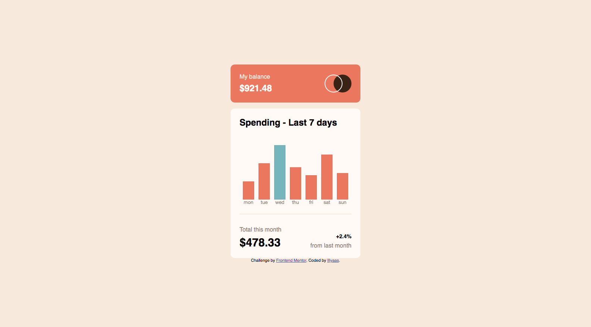

# Frontend Mentor - Expenses chart component solution

This is a solution to the [Expenses chart component challenge on Frontend Mentor](https://www.frontendmentor.io/challenges/expenses-chart-component-e7yJBUdjwt).

## Table of contents

- [Overview](#overview)
  - [The challenge](#the-challenge)
  - [Screenshot](#screenshot)
  - [Links](#links)
- [My process](#my-process)
  - [Built with](#built-with)
  - [What I learned](#what-i-learned)
  - [Continued development](#continued-development)
  - [Useful resources](#useful-resources)
- [Author](#author)

## Overview

### The challenge

Users should be able to:

- View the bar chart and hover over the individual bars to see the correct amounts for each day
- See the current day’s bar highlighted in a different colour to the other bars
- View the optimal layout for the content depending on their device’s screen size
- See hover states for all interactive elements on the page
- **Bonus**: Use the JSON data file provided to dynamically size the bars on the chart

### Screenshot

### Links

- Solution URL: [Solution](https://github.com/Illyaas4Show/Expenses-chart-component/tree/main/src)
- Live Site URL: [Live site](https://expenseschartcomponentchallenge.netlify.app)

## My process

### Built with

- Semantic HTML5 markup
- CSS custom properties
- Flexbox
- Mobile-first workflow
- SCSS
- Chart JS

### What I learned

- This is my first time using ChartJS and it was quite fun but unsurprisingly a little annoying! What I didn't like about how I used this framework is that I am still not fully familiar with JavaScript and I had to do a lot of searching things up and just typing it out from what I see. Though I understand how to use it, I don't fully understand what it does. However, I don't think I will be needing this framework any time soon so I will not be learning it now.

- I also learnt about the [7 - 1 pattern](https://sass-guidelin.es/#architecture) for SCSS which was absolutely awesome as it made writing SCSS so much easier and cleaner.

### Continued development

I will continue to learn about SCSS and how it can be used to make styling easier by using functions and mixins and other things that SCSS has.

### Useful resources

- [SCSS guide-sheet](https://sass-guidelin.es/#architecture) - This helped be learn a lot more about SCSS and how to use it as an advantage.
- [Chart JS](https://www.chartjs.org/docs/latest/) - This helped me with ChartJS syntax.

## Author

- Frontend Mentor - [@Illyaas4Show](https://www.frontendmentor.io/profile/Illyaas4Show)
- Github - [@Illyaas4Show](https://github.com/Illyaas4Show)

Thank YOU for viewing!
Have a nice day!
